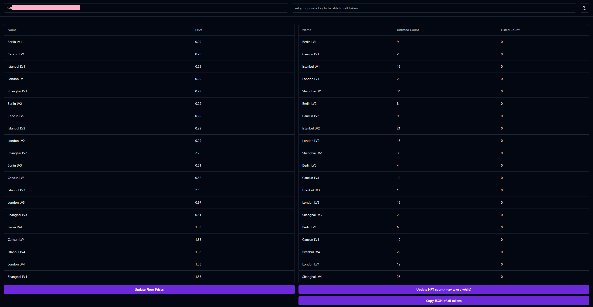

Simple project to check ur wallet progress in [Bybit Mantle City event](https://www.bybit.com/en/web3/nft-pro/primary/Mantle_City_Canvas)

- Can fetch total amount of NFT's on wallet 
- Can fetch NFT id's - which are listed and which are not (to then able to mass transfer them with web3.js lib - not included in this project)
- Get floor information for each type of NFT (makes easy to list)
- Get total amount of holders which have > 4 NFT on their wallet
- Listing functionality is not included in the project

To run go to each folder and type - npm install
Then - npm run dev and the project is up and running